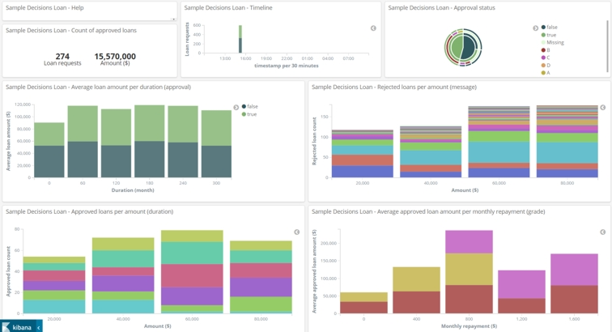
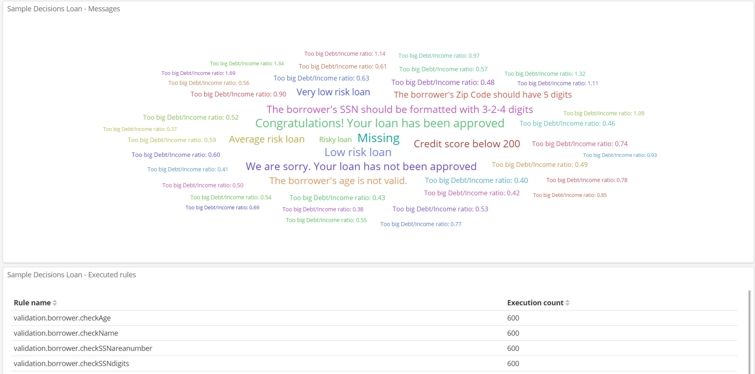
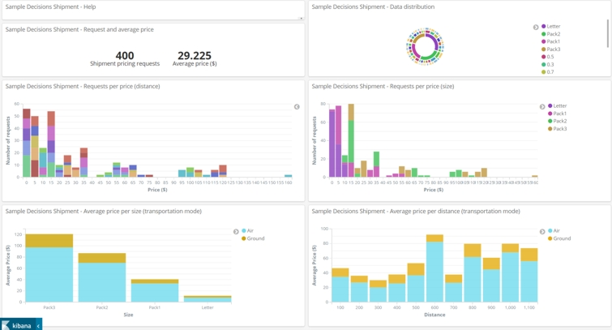
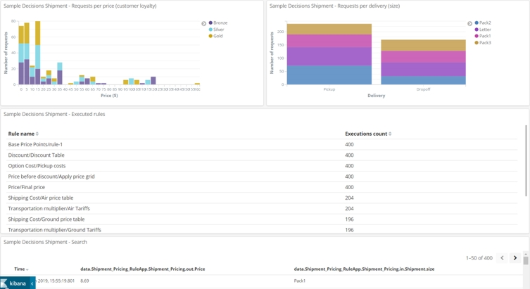

# Sample details
 
 You run the rulesets in the Samples Console, and check the results emitted to the Kibana dashboards.
 
 ## Scenario

You start with the Sample Decisions Loan Dashboard in the first example. You use a Samples Console command to run a decision service ruleset with data for 200 transactions. The results are emitted to Kibana via Business Automation Insights. You check the results in the dashboard, which displays the incoming data as meaningful information for checking rules and monitoring transactions. 

The first run shows a recurring error. You use a different Samples Console command to run the ruleset with correct data. The dashboard shows the transactions are processed without the recurring error the second time. 

In the second example, you switch to the Sample Decisions Shipment Dashboard. You run a ruleset for a decision model service, and the results are displayed in the Kibana dashboard. The dashboard enables you to check the state of the service and to spot trends in shipping activities. 
 
## Example 1: Loan Validation Service

1.   In the Samples Commands tab, expand **Samples Commands > Rule Execution Server > BAI custom dashboards**.
2.   Double-click the **executeLoanValidation** command to run 200 transactions on the Loan Validation Service ruleset.
3.   Open Kibana and the dashboard named Sample Decisions Loan Dashboard.

You see that many loans are rejected for invalid data. The following message occurs frequently: 

    The borrower's SSN should be formatted with 3-2-4 digits

4.   Set the dashboard to autorefresh mode with a five-second delay.

Now, you run the second set of values with the error fixed:

1.   In the Samples Commands tab, expand **Samples Commands > Rule Execution Server > BAI custom dashboards**.
2.   Double-click the **executeFixLoanValidation** command to run 200 transactions on the Loan Validation Service ruleset.
3.   Look for the new results in the dashboard. More loans are approved, and the message occurs fewer times:

## Example 2: Shipment Pricing Service

1.   In the Samples Commands tab, expand **Samples Commands > Rule Execution Server > BAI custom dashboards**.
2.   Double-click the **executeShipmentPricing** command to run 200 transactions on the Shipment Pricing ruleset.
3.   Open Kibana and the dashboard named Sample Decisions Shipment Dashboard.

The shipment dashboard provides information about costs and modes of transportation:

## Cleaning
1.   In the Samples Commands tab, expand **Samples Commands > Rule Execution Server > BAI custom dashboards**.
2.   Double-click the **clean** command. It does the following tasks:

-   Deletes the sample server profile. The next time the sample server is started, it creates another profile.
-   Removes the generated class files.
 
 ## How this sample works
 
 For the setup, this sample uses:
  - The **resetup** task to enable the Business Automation Insights emitter (see [Enabling the emitter with Ant](https://www.ibm.com/support/knowledgecenter/SSQP76_8.10.x/com.ibm.odm.distrib.config/topics/tsk_emitters_ressetup.html)).
  - The Decision Center Ant **deploy** task to deploy the ruleset to the Rule Execution Server (see [Deploying decision services by using Ant tasks](https://www.ibm.com/support/knowledgecenter/SSQP76_8.10.x/com.ibm.odm.dcenter.deploy/topics/con_cmg_headless.html)).
  - The Rule Execution Server API in Java™ to set the ruleset properties (see [Managing resources by using the REST API](https://www.ibm.com/support/knowledgecenter/SSQP76_8.10.x/com.ibm.odm.dserver.rules.res.managing/topics/con_res_restapi_rsrcmng_intro.html)).
  
The rulesets are run by calling an HTDS service in Java. The input data is in JSON files in the data directory (see [Executing rules by using the REST service](https://www.ibm.com/support/knowledgecenter/SSQP76_8.10.x/com.ibm.odm.dserver.rules.res.developing/topics/con_res_restapi_rlset_exec_intro.html)). These files were created by using a data generator that is provided included in this sample. 
  
You can apply this sample to a ruleset of your own making by creating a data generator for ruleset and changing the build.xml file.
  
 ## Source files
 
The source files for this sample are in the directory *SampleInstall*/executionserver/samples/baiDashboards. You can view and modify the sample source files in Rule Designer.

To import the sample source files into your Rule Designer workspace:

1.   Open the Samples Console.
2.   Open the Samples and Tutorials tab.
3.   Expand **Rule Execution Server > Samples**.
4.   Under **decisions-bai-sample-dashboards-master**, click **Import projects**. 

**Note:** The **View Instructions** link does not work for this sample because this documentation is not available in the IBM Knowledge Center.

5.   Switch to the Java perspective to view and modify the files.

[**Main page**](../README.md)

Version 1.2.1
